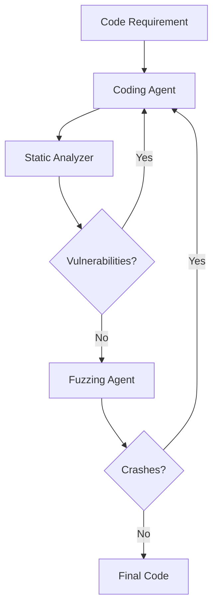

# AutoSafeCoder: A Multi-Agent Framework for Securing LLM Code Generation through Static Analysis and Fuzz Testing

[](https://neurips.cc/Conferences/2024)
[](https://github.com/SecureAIAutonomyLab/AutoSafeCoder)
[](https://www.python.org/)

## Authors
- Ana Nunez* (University of Texas at San Antonio)
- Nafis Tanveer Islam (University of Amsterdam)
- Sumit Jha (Florida International University)
- Paul Rad* (University of Texas at San Antonio)

*Secure AI and Autonomy Laboratory, UTSA

## Abstract
AutoSafeCoder introduces a novel multi-agent framework that addresses the critical challenge of security vulnerabilities in LLM-generated code. By combining static analysis, fuzz testing, and iterative improvement through GPT-4o agents, the system achieves a 13% reduction in code vulnerabilities while maintaining high functional correctness.

## Key Contributions
- **Multi-Agent Architecture**: Innovative system combining coding, analysis, and testing agents
- **Comprehensive Security**: Integration of both static and dynamic vulnerability detection
- **Iterative Improvement**: Feedback loops for continuous code enhancement
- **Empirical Results**: 13% vulnerability reduction with only 3% functionality loss
- **Open Source**: Complete framework available for research and implementation

## Technical Architecture
### Agent Components


1. **Coding Agent (GPT-4o)**
   - Generates initial code
   - Implements security fixes
   - Maintains functionality


2. **Static Analyzer Agent**
   - MITRE CWE-based vulnerability scanning
   - Security pattern recognition
   - Feedback generation
     


3. **Fuzzing Agent**
   - Type-aware mutation testing
   - Runtime crash detection
   - Input seed generation


### Process Flow


## Implementation Details
- **Platform**: Red Hat Enterprise Linux 8.10
- **Hardware**: Tesla V100S GPU (32GB)
- **Environment**: Python 3.10.14 (Sandboxed)
- **Maximum Iterations**: 
  - Static Analysis: 4 loops
  - Fuzzing: Until no crashes or timeout

## Evaluation
### Datasets
- **SecurityEval**: 121 Python samples with 69 CWE vulnerabilities
- **HumanEval**: Functional correctness benchmark

### Performance Metrics
| Metric | GPT-4o | AutoSafeCoder | Improvement |
|--------|---------|---------------|-------------|
| Vulnerable Code | 49% | 36% | -13% |
| Pass@1 (Functionality) | 90.85% | 87.80% | -3.05% |
| Crash Fixes | N/A | 8% (5/65) | N/A |
| Static Analysis Fixes | N/A | 53% | N/A |

## Strengths
- Practical implementation of multi-agent security
- Comprehensive vulnerability detection
- Minimal impact on code functionality
- Open-source and reproducible
- Quantitative security improvements

## Limitations
- Moderate vulnerability reduction (13%)
- Limited fuzzing success rate
- Python-specific implementation
- GPT-4o dependency
- Sandbox environment constraints

## Installation & Usage
```bash
# Clone the repository
git clone https://github.com/SecureAIAutonomyLab/AutoSafeCoder
cd AutoSafeCoder

# Install dependencies
pip install -r requirements.txt

# Run the framework
python autosafecoder.py --input code_requirement.txt
```

## Citation
```bibtex
@inproceedings{nunez2024autosafecoder,
  title={AutoSafeCoder: A Multi-Agent Framework for Securing LLM Code Generation through Static Analysis and Fuzz Testing},
  author={Nunez, Ana and Islam, Nafis Tanveer and Jha, Sumit and Rad, Paul},
  booktitle={Advances in Neural Information Processing Systems},
  year={2024}
}
```

## Security Note
While AutoSafeCoder significantly improves code security, it should not be the sole security measure for critical systems. Always perform additional security reviews for production code.

## Links
- [GitHub Repository](https://github.com/SecureAIAutonomyLab/AutoSafeCoder)
- [NeurIPS 2024](https://neurips.cc/Conferences/2024)
- [UTSA Secure AI and Autonomy Lab]() 
